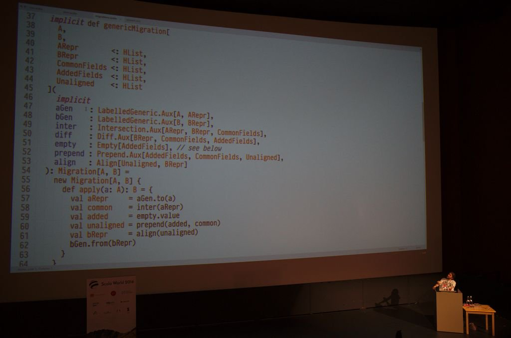

# Scala World 2016 Conference Report

Last Monday a couple of hundred members of scala's functional programming community turned out at the Rheged
Centre in Penrith for two days of talks given by some of the most prominent experts in the language. The small-ish 
size of the event no doubt in part due to it's relative inaccessibility, in more than one sense of the word. A fact the 
organisers seem fairly proud of.

The stage was well set on the evening before the start of the conference when, on asking for three pints of a guest beer
called Yolo at a local bar, a helpful voice chirped up 'I think you'll find that's Yolii'. Found the right place at
least then.

The speaking line-up was a bit depleted due to several last minute drop-outs. This resulted in a bit of organisational
confusion as attendees were left without a schedule right up until the start of the conference on Monday morning. A
fact that organiser Jon Pretty (Propensive) was reminded of throughout.

---- 

## Day One

### Compilers are (in memory) Databases - Martin Odersky

Monday's keynote was given by Martin Odersky, the creator of the scala language.
He started with a brief history of the various compiler architectures he has worked on, before explaining
how the design of current project dotty (a ground-up rewrite of the scala compiler) has been inspired by functional
reactive database systems.

Dotty is still a work-in-progress and not likely to replace the current scala compiler for a couple of years at least,
that said, it is already complete enough to bootstrap itself and able to compile a number of existing OSS libraries.
Throughput (lines of code compiled per second) is reportedly twice that of the existing scalac and Martin expects that
to increase to a factor of three or four times before release.

### Practical ScalaCheck - Noel Markham

Noel Markham from 47 degrees (a scala consultancy and sponsor of the conference) gave a great introduction to 
property-based testing using the ScalaCheck library.

The approach can be described something like this:

- Specify an invariant for the code under test, e.g. the function to find the absolute value of an int, Math.abs, should
always return a value greater than or equal to zero.

- Describe the range of inputs over which the invariant should hold, e.g. all integer values.

- To run the test, the framework generates a number of inputs (100 by default) and checks that the invariant
holds when the function is applied to each of them.

The generated inputs are not quite random, instead concentrating on boundaries (e.g. Int.MaxValue) where errors are
more likely to occur.

The technique is very effective at finding issues that may have been missed during the original design and/or 
implementation of the code. A good example is the invariant described above for Math.abs, where it will return a 
negative result when passed Int.MinValue as input, because the range of int on the JVM has one more negative value than
positive.

**Slides** - http://noelmarkham.github.io/practical-scalacheck/index.html#/

**Exercises** - http://www.47deg.com/blog/scalacheck-for-scala-exercises

### CBT: fast, intuitive, convenient scala builds - Jan Christopher Vogt

Almost all scala projects are built with sbt. Originally the 'simple' build tool, the name had to be changed
once it had become laughably innacurate. By creating CBT, Jan Christopher Vogt hopes to provide a simpler, faster 
alternative that integrates more naturally with the unix command-line, without losing the flexibility and power that 
are sbts strengths.

This looks like an interesting project, and sbt could certainly do with some competition, but I wonder whether
all of the conceptual bulk of sbt (scopes, axes, configurations, etc.) accumulated for a reason and will either creep
into CBT over time or leak out in other ways.

A couple of great little tools came up during the talk:

- **nailgun:** Startup times for the JVM are ridiculously slow, making it a poor choice for short-lived jobs. Nailgun
(http://www.martiansoftware.com/nailgun/) solves this by keeping a JVM running in the background as a server and using 
a client written in C to run tasks in it.  Bit of a revelation to see Java programs completing (kind of) with single 
digit millisecond duration.

- **coursier**: Coursier (https://github.com/alexarchambault/coursier) can be used as a drop-in replacement for the 
default Ivy dependency resolver used by sbt. Addresses one of the biggest gripes most people have with sbt (aside from 
the fiddly setup); the amount of time spent sat there waiting for the 'Resolving...' message to go away.

**Slides** - https://docs.google.com/presentation/d/1odc1NbkpXPFuhnln-rusB1Dkk3dz7yOeHh0C9WDHodk/

**Earlier version of talk** - http://www.nescala.org/2016/slides/cvogt.pdf

### Generic Derivation: The Hard Parts - Travis Brown

A talk by Travis Brown, creator of the Circe (SUR-see, like in GoT) JSON library amongst other things, on the 
difficulties of using generic programming to implement boilerplate-free marshalling/unmarshalling of JSON data.

The title of the talk sounded a bit intimidating for me, so I went to the CBT one instead.

**Slides** - https://meta.plasm.us/slides/scalaworld/#1

### The Type Astronauts Guide to Shapeless - Dave Gurnell

Introductory workshop on shapeless, the generic programming library for scala created by Miles Sabin.

The core construct provided by the library is the HList (for heterogenous list), a data structure where the type (and
number of) elements the list contains is reflected in it's type signature. So, for a list containing a String, an Int
and a Boolean, we'd have something like:

```scala
val strIntBool: String :: Int :: Boolean :: HNil = ???
```

As opposed to the following, which is what you would have if you put the same elements in a standard scala Seq, where
the only information it contains is the closest common ancestor of the element's types (Any):

```scala
val strIntBool: Seq[Any] = ???
```

Shapeless also provides facilities to convert any case class or tuple to and from this representation, and to perform
collection style operations on HLists (e.g. map) in a typesafe manner.

The library can be used to implement functionality that we might otherwise have used reflection for, e.g. take all the
fields of any arbitrary object and write them out as a line of CSV data. The big advantage shapeless has is that this 
can all be done without stepping outside the type system, therefore giving the compiler the opportunity to check our 
work.

There's a huge amount more to the library, all built around the same basic idea of typesafe generic programming. It
has made a big impact on the scala ecosystem since the 1.0 release a couple of days before the start of 2012, with at 
least 60-odd other libraries depending on it and 80 contributors to the project

One unfortunate aspect of working with shapeless is the insanity of the type signatures. In the picture below, the 
first 17 lines on screen constitute the type signature of the function being declared, the body of which is 9 lines 
long.  This does not seem to be unusual.


**Slides** - https://github.com/davegurnell/shapeless-guide-slides

**Repo** - https://github.com/davegurnell/shapeless-guide

**Book (WIP)** - https://github.com/davegurnell/shapeless-guide/blob/develop/dist/shapeless-guide.pdf

### A Whirlwind Tour of scala.meta - Olafur Pall Geirsson

A workshop on the metaprogramming framework used in macros to modify the AST of a program during compilation.
Blighted by lack of bandwidth on the conference WiFi (wireless fidelity? what on earth is that meant to mean?), 
which apparently prevented attendees from following along.

Clashed with Dave Gurnell's shapeless workshop, so unfortunately I had to skip this one.

**Workshop** - https://olafurpg.github.io/scala.meta-workshop/

### Pure Functional Database Programming with Fixed Types - Rob Norris

Also clashed with the something, heard great feedback from those who attended though.

**Slides** - http://tpolecat.github.io/presentations/sw2016/slides.html#1

**Doobie exercises** - http://www.47deg.com/blog/announcing-doobie-for-scala-exercises

### Run Wild, Run Free! - Raul Raja

For me, this talk contained the most practical and immediately useful content presented at the conference.

Raul presented solutions to some of the most common problems he has encountered whilst providing consultancy to around
10 teams of scala developers since 2013. All of which seemed unfortunately familiar to me, to some extent. Here's one
example:

```scala
def getCountryCode(personId : String) = {
  findPerson(personId) map { maybePerson =>
    maybePerson map { person =>
      person.address map { address =>
        findCountry(address.addressId) map { maybeCountry =>
          maybeCountry map { country =>
            country.code
          }
        }
      }  
    }
  }
}
```

Design patterns, relatively simple ones, exist that can be used to avoid creating deeply nested, hard to follow code 
like this. The problem in Raul's opinion is that newcomers to scala (often coming from an OO background) just aren't 
aware of them.

The following three strategies were presented, in context of the problems that they solve, with code examples:

- Algebraic design and sealed hierarchies for safer exceptions control (using the Xor datatype, monad transformers)
- Abstract over return types for code reuse (using higher-kinded types in function signatures)
- Abstract over implementations to increase flexibility and composition (using free monads)

**Repo** - https://github.com/47deg/run-wild-run-free

**Slides (PDF)** - https://github.com/47deg/run-wild-run-free/blob/master/presentation.pdf

**Slides** - https://speakerdeck.com/raulraja/run-wild-run-free

### Enterprise Algebras - Tim Perrett

As principal engineer at Verizon, Tim Perrett has a great perspective on adoption of scala and FP in a large-scale 
enterprise setting. Apparently his team is responsible for over 1000 code repos, 85% of which is scala. I'd be 
surprised if the language has been adopted on a larger scale anywhere (twitter aside, maybe?).

Tim talked a little about their approach to onboarding new staff, no big surprises; self-directed learning, mentorship 
and practice - can't hurt to have people like Runar Bjarnason (one of the two authors of Functional Programming in 
Scala) around either. He then moved on to describe the basic principles they use to structure their codebase; choosing 
libraries over frameworks and using free monads to implement modules as albegras/DSLs.

I have to admit it all got a bit too much for me at one point:


Nope. No idea what's going on there.

I particularly like the 'wins' he calls out:

- Doing FP has allowed us to recruit and retain some brilliant minds.
- The application of Free, Cofree, Fix and other advanced type-level paradigms make your software easier to refactor,
and cheaper over time.

**Slides** - http://www.slideshare.net/timperrett/enterprise-algebras-scala-world-2016

**Verizon OSS** - https://github.com/verizon

**Knobs (config lib)** - https://github.com/verizon/knobs

### Learn You (Advanced) Akka Streams for Great Good! - Heiko Seeberger

Heiko Seeberger walked us through a live coding demo of the akka streams API, implementing a client for the 'server
sent events' (SSE) push mechanism for HTTP. The code looked great but would have appreciated a bit more explanation of
'why' alongside the 'how', I guess that's the nature of live coding.

**Code** - https://github.com/hseeberger/lyas

### Distributed Systems vs. Compositionality - Roland Kuhn

Impenetrable explanation of how the pi calculus (me neither) forms the theoretical underpinnings of an experimental new
typed (and therefore composable) iteration of akka. As far as I could tell, exactly two people in the room kept up -
Aleksandar Prokopec (a concurrent and distributed programming researcher, previously at EPFL and now Oracle) and 
Martin Odersky.

**Slides** - http://www.slideshare.net/rolandkuhn/distributed-systems-vs-compositionality

----

## Day Two

### ScalaFiddle - Otto Chrons

Otto Chrons of [diode](https://github.com/ochrons/diode) non-fame has released an awesome-looking scala equivalent
to JSFiddle. Allows users to embed a live code editor and accompanying console session in web pages, this looks great
for tutorials, project docs, etc.

[ScalaFiddle](https://scalafiddle.io/)

### FOR, What is it good for? Absolute[T] Nothing - Dick Wall and Josh Suereth

Lots of things you can do with scala's 'for' syntax. Spent a long time on basics that very few people in
the room will have been unaware of and then flew threw some more interesting bits at the end.

Included a somewhat controversial recommendation to use 'for' in some situations where a simple monad transformer
might be found. Something to do with dependencies and the rule of least power. Audience didn't seem to approve.

One noteworthy point is the mention of Josh's automatic resource management project 
(https://github.com/jsuereth/scala-arm), looks useful and something I've not come across previously. Unfortunately
this seems to have been superseded later in the day by Denys Shabalin.

**Repo** - https://github.com/dickwall/use-the-fors-luke

### Make Your Programs Free - Pawel Szulc

Great last-minute live coding session on free monads, covering implementation of a simple algrebra, vertical and 
horizontal composition. Worth going through the history of the repo commit-by-commit to see how the final version is
built up, as Pawel did in the talk. Also to observe the content being put together at 2am on the day of the talk!

The intial example is taken directly from the book 'Functional Programming in Scala', published towards the end of 
2014.

**Slides** - http://www.slideshare.net/paulszulc/make-your-programs-free

**Code** - https://github.com/rabbitonweb/make-your-programs-free/

### Can We Make Concurrency in Scala Safer? - Phillip Haller

Missed this one, and I can't find any links for it online. Here's the abstract though:

> Concurrent programming is infamous for its difficulty. Hazards like
> race conditions manifest themselves as bugs that are often hard to
> find and fix. This talk presents LaCasa, a minimal Scala extension
> designed to express concepts such as isolation and access permissions
> via types. Among others, LaCasa's refinement of Scala's type system
> enables enforcing the isolation of actors, at compile time. Building
> on the object capability model, LaCasa also provides strong security
> properties, enabling applications beyond safe concurrency.

### First-Class Coroutines for Scala - Aleksandar Prokopec

### quaich: A serverless microframework for event-driven Scala Programming on AWS Lambda - Brendan McAdams

Sneak preview of a scala equivalent to Amazon's [chalice](https://github.com/awslabs/chalice), 'a serverless
microframework for AWS'.

AWS Lambda provides infrastructure to run your code on that is only actually 'allocated' when your code needs to run.
In response to an incoming event (HTTP request, S3 trigger) lambda will load your code into an execution environment,
use it to process the event and then deprovision the associated resources after, thus relieving you of the obligation 
to manage the infrastructure the code runs on.

The function to be executed must implement an API supplied by AWS, and there's a fairly large amount of administrative
overhead in configuring API gateways, permissions and uploading your code. The aim of this project is to automate as
much of the grunt work as possible.

The idea of being able to write a function and then make it available on the web with a single command without the 
need to provision, configure and maintain the infrastructure it runs on is really exciting. Just not quite sure what to
do with it yet.

**Code** - https://github.com/bwmcadams/quaich

### Tales from Compiling for the JVM - Lukas Rytz

### Specialising Parsers for Queries - Manohar Jonnalagedda

### Essential vs. Accidental Complexity in Scala & Dotty, Towards a Puzzler-Free Future - Andrew Phillips

### The Story of a Parallel Scala Library - Vlad Ureche

### Managing Your Resources - Denys Shabalin

Seems that Denys has grown tired of talking about his much-hyped work on 
[scala-native](https://github.com/scala-native/scala-native), unfortunately for me, I was quite looking forward to 
hearing more about it.

Instead, he presented a strikingly simple solution to the ever-present issue (on the JVM at least) of releasing 
resource handles when you're done with them. At about 40 lines of code, one implicit param and no dependencies
in sight it seems a bit too good to be true, but no-one present managed to pick any real holes in it 
(despite a few tries). 

**Code** - https://gist.github.com/densh/75d2d3063571d89ee34e161b4a61c74a
