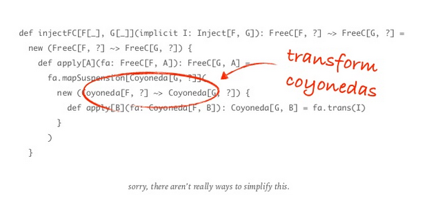

### Enterprise Algebras - Tim Perrett

As principal engineer at Verizon, Tim Perrett has a great perspective on adoption of scala and FP in a large-scale 
enterprise setting. Apparently his team is responsible for over 1000 code repos, 85% of which is scala. I'd be 
surprised if the language has been adopted on a larger scale anywhere (twitter aside, maybe?).

Tim talked a little about their approach to onboarding new staff, no big surprises; self-directed learning, mentorship 
and practice - can't hurt to have people like Runar Bjarnason (one of the two authors of Functional Programming in 
Scala) around either. He then moved on to describe the basic principles they use to structure their codebase; choosing 
libraries over frameworks and using free monads to implement modules as albegras/DSLs.

I have to admit it all got a bit too much for me at one point:

Nope. No idea what's going on there.

I particularly like the 'wins' he calls out:

- Doing FP has allowed us to recruit and retain some brilliant minds.
- The application of Free, Cofree, Fix and other advanced type-level paradigms make your software easier to refactor,
and cheaper over time.

**Slides** - http://www.slideshare.net/timperrett/enterprise-algebras-scala-world-2016

**Verizon OSS** - https://github.com/verizon

**Knobs (config lib)** - https://github.com/verizon/knobs

